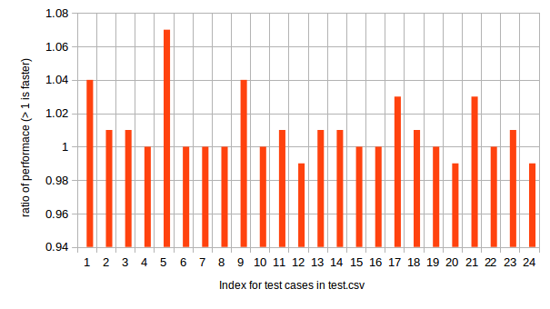

# Performance results over perf test suite from OpenCV

## calib3d
x-axis denotes index of test case in test.csv

y-axis denotes ratio of performance change (more than 1 is improvement in perf)

## core  
x-axis denotes index of test case in test.csv
y-axis denotes ratio of performance change (more than 1 is improvement in perf)

## dnn  
x-axis denotes index of test case in test.csv

y-axis denotes ratio of performance change (more than 1 is improvement in perf)

## features2d  
x-axis denotes index of test case in test.csv

y-axis denotes ratio of performance change (more than 1 is improvement in perf)

## imgproc  
x-axis denotes index of test case in test.csv

y-axis denotes ratio of performance change (more than 1 is improvement in perf)

## objdetect  
x-axis denotes index of test case in test.csv

y-axis denotes ratio of performance change (more than 1 is improvement in perf)

## video
x-axis denotes index of test case in test.csv

y-axis denotes ratio of performance change (more than 1 is improvement in perf)

